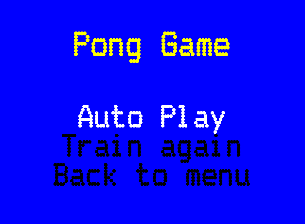
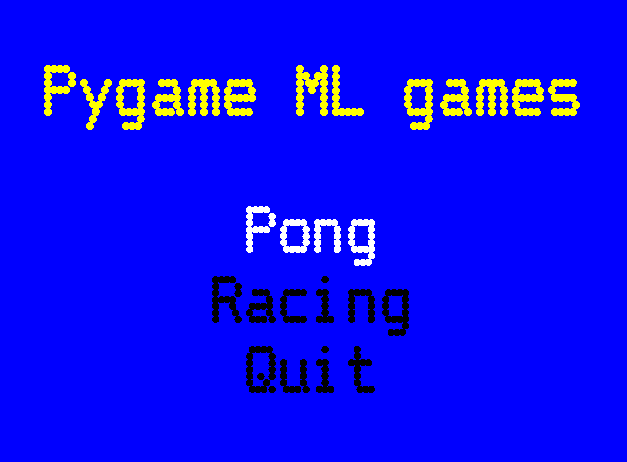

# Pygame Machine Learning
Machine learning applied to Pygame games.


[](https://twitter.com/unmonoqueteclea)
[](https://www.python.org/)
[](https://github.com/unmonoqueteclea/pygame-ML/blob/master/LICENSE)

More projects on [my blog](https://unmonoqueteclea.github.io)


## Description
This tool applies Machine Learning to play autonomously to some little Pygame games. Before the algorithm is able to play autonomously, user should train it playing a few minutes to each game.
Here, you can see an example of the algorithm playing to the currently implemented games:
* Pong: Trained with 1600 rows of data
  * Left player is controlled by IA. 
  * Right player is an algorithmic player that only compares paddle position with ball position



* Racing Game: Trained with 16000 rows of data




This tool doesn´t use raw pixels for making its predictions. Instead, it uses internal game data:
* Player position
* Other players position
* Ball position
* etc.

## Usage

The code has been tested with **Python 3.6**, it should work with every 3.x Python version.

* Install pygame, scipy and bigml (if using BigML ML engine)

```
pip install pygame
```

```
pip install scipy
```

```
pip install bigml
```
* Open Main Window
```
python main.py
```
* If using BigML engine, put your username and API key in **config.py** file.
* Choose a game and train it. Needed training time depends on the game:
    * **Pong** - Between 500 and 2500 rows is OK
    * **Racing** - Between 5000 and 30000 rows is OK

* After playing it, press **(q)** to stop playing and start creating and training the model
  
  **It will take between 1 and 4 minutes to train the model**

* Choose a game and press **Auto play**

## Machine Learning Engines

### BigML
Currently, there is only one Machine Learning engine implemented, [BigML](https://bigml.com/).
You have to create a free account, and get your API key.
BigML allow us to create a dataset, create a model, and train it in three line of code. Here, we are using its [Python Bindings](https://bigml.readthedocs.io/en/latest/)

## TO DO
- [x] Racing Game
- [ ] Avoid blocking game screen while training
- [ ] New ML engine: Scikit-learn
- [ ] New ML engine: Keras
- [ ] New game: Tetris

